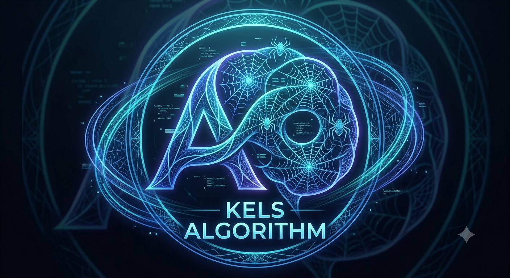

# Kel's Algorithm: Cycle-Spider PQC
<p align="center">
  
</p>


### 💻 Core Programming Languages


### ⚙️ Core Systems


### 🛡️ Cybersecurity & Offensive Auditing


### 🛠️ Low-Level Infrastructure & Performance


### 🔄 DevOps, Infrastructure & Build Tools


### 🧠 Artificial Intelligence & Quantum


### ☁️ Cloud Providers


### 🖥️ Platform Support & Hardware Architecture


</div>
)

# Kel's Algorithm (Cycle-Spider Framework)
> Note: This overview is generated based on the source files and repository code shown in 1395.mp4.

---

## 🕷️ What is this about?

This project is called **Kel's Algorithm** (also known as the **Cycle-Spider Framework**). 

Think of it like a futuristic digital castle built to protect secret data. It is specifically made to stop **quantum computers**—which are upcoming, ultra-powerful supercomputers that will be smart enough to easily break today's normal computer locks. 

---

## ⚙️ What does this do?

It uses super-hard math to lock up files so nobody else can read them. Instead of just being a regular, quiet padlock, it acts like a smart home security system with a mind of its own:

* **It Changes Shapes (Polymorphic):** If the system senses someone trying to break in, it instantly shifts its math settings to become even harder to crack. 
* **It Sets Traps (Canaries & Honeypots):** The code leaves out fake "secrets" to trick hackers. If a hacker touches one of these fake files, an alarm goes off.
* **It Freezes the Bad Guys (Tarpitting):** When a hacker triggers a trap, the code forces their computer into a boring, endless loop of useless math homework to waste their time and slow them down to a crawl.
* **It Erases Evidence (Zeroizing):** If things get really dangerous, the code instantly overwrites its own memory with rows of zeros (`0x00`) so the hacker can't steal anything.

---

## 🛠️ What problems does this solve?

| The Problem | How Kel's Algorithm Fixes It |
| :--- | :--- |
| **Future Supercomputers:** Normal internet security (like RSA) won't work against future quantum computers. | It uses **Post-Quantum Cryptography (PQC)**, which is special math that quantum computers can't easily solve. |
| **Sneaky Hackers:** Normal defense systems just sit there and hope the lock holds. | This system actively fights back. It traps hackers, records what they did, and blocks their IP addresses forever. |

---

## 🚀 How to install it?

To set this up, you need a computer with a coding language called **Python** installed. 

1. **Download the code:** Open your computer's terminal (the command screen) and type this to copy the files from GitHub:
```bash
   git clone [https://github.com/credkellar-boop/kels-algorithm](https://github.com/credkellar-boop/kels-algorithm)

### Option A: Local Installation

**1. Clone the repository:**
```bash
git clone [https://github.com/credkellar-boop/kels-algorithm.git](https://github.com/credkellar-boop/kels-algorithm.git)
cd kels-algorithm
